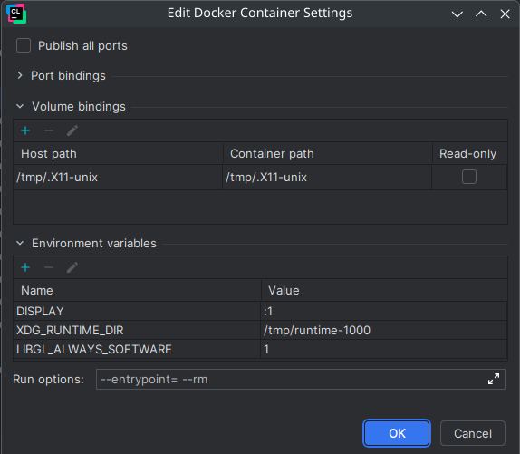

# Development environment setup

Here I will describe how to run compile and run the project on Linux + X11 + Docker + Jetbrains CLion.

## 1. Build the development environment docker image

This docker image includes everything needed to compile and run the project as well as headers and libraries for X11 to connect to your host.

`docker build -t orientview-dev-env .`

## 2. Setup Docker toolchain inside Clion

1. Go to `File -> Settings -> Build, Execution, Deployment -> Toolchains`
2. Click `Add` (plus symbol)
3. Select Docker
4. Select the previously built `orientview-dev-env` image
5. In `Container settings` click the triple dot button.
6. Add a volume: Host path: `/tmp/.X11-unix` Container path: `/tmp/.X11-unix`
7. Add these environment variables: `DISPLAY=:1`, `XDG_RUNTIME_DIR=/tmp/runtime-1000`, `LIBGL_ALWAYS_SOFTWARE=1`
8. Set run options to `--entrypoint= --rm`

## 3. Use the Docker toolchain

1. Go to `File -> Settings -> Build, Execution, Deployment -> CMake`
2. Choose your CMake profile or make a new one
3. Set the toolchain to the Docker toolchain

## 4. Allow docker to connect to X11

1. Run `xhost +local:docker`